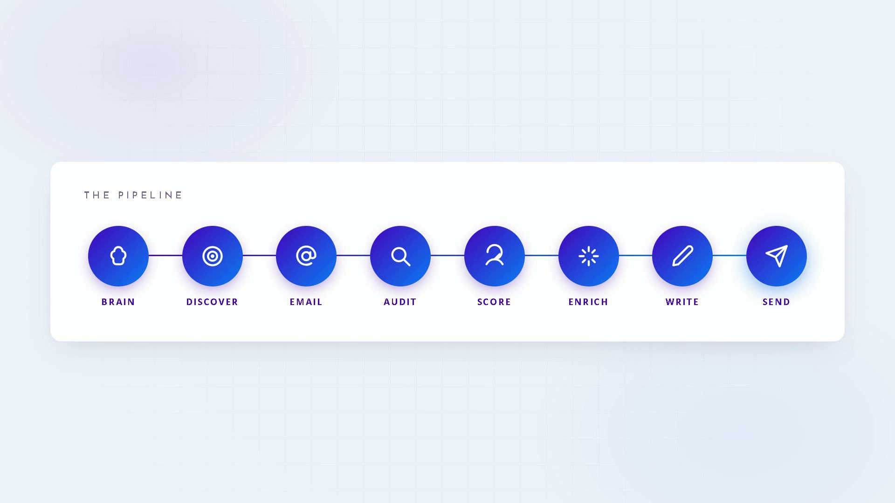

<div align="center">

# LeadForge AI

**A pipeline of AI agents that finds businesses, audits their marketing, writes personalized cold outreach, and sends it** — with open/reply tracking, CAN-SPAM compliance, sending warmup, and automatic follow-ups.

[](https://github.com/abeermeer/leadforge-ai/actions/workflows/ci.yml)


</div>

## Demo

https://github.com/abeermeer/leadforge-ai/raw/main/docs/media/leadforge-demo.mp4

> If the player doesn't load inline, [**click here to watch the 20-second demo**](docs/media/leadforge-demo.mp4).

<div align="center">
  <a href="docs/media/leadforge-demo.mp4">
    
  </a>
</div>

---

## What it does

Paste your agency's website. The **Agency Brain** reads it, learns what you sell and who your ideal client is, then a pipeline of agents does the rest:

| Agent | Job |
|---|---|
| 🧠 **Brain** | learns your services + ideal-client profile from your own site |
| 🔍 **Discover** | finds matching businesses (Google Maps, Google Search, directories) |
| ✉️ **Email Find** | locates a real inbox (site scrape → pattern → Hunter) |
| 🩻 **Audit** | x-rays their website, SEO, Meta ads, and Google ads |
| 📊 **Score** | ranks every lead 0–100 against your ideal client |
| ✨ **Enrich** | adds reviews + social intel (high-fit leads only, cost-gated) |
| ✍️ **Write** | drafts an opener citing one real finding, pitching one matching service |
| 🚀 **Send** | delivers with warmup, rate limits, unsubscribe, tracking, follow-ups |

Everything is visible live in **"The Machine"** — a mission-control dashboard rendered as a wired node-graph on a dotted canvas, themed to the agency's brand. Run the whole pipeline on autopilot with one click, or fire any stage manually; tick individual brands to audit or write for just that selection.

```
Agency Brain → Discover → Email Find → Audit → Score → Enrich → Write → Send → Track → Follow-up
```

Each stage writes its result back before the next runs. A reply, unsubscribe, or bounce cancels the remaining follow-ups automatically.

## Architecture

```
┌──────────────────────────── React (Vite + Tailwind) ────────────────────────────┐
│  Mission-control dashboard · live agent pipeline · audit tabs · settings         │
└───────────────────────────────────────┬──────────────────────────────────────────┘
                                         │  /api  (JWT, per-user, multi-tenant)
┌───────────────────────────────────────▼──────────────────────────────────────────┐
│                              FastAPI backend                                      │
│  auth · agency brain · discovery · email finder · audit · scoring · enrichment    │
│  AI writer · SendGrid sender · webhooks · reply tracker · follow-up sequencer     │
├──────────────────────────────┬────────────────────────────────────────────────────┤
│  PostgreSQL (SQLAlchemy)     │  Celery + Redis — 5 queues + beat                   │
│  Fernet-encrypted API keys   │  (Redis down → capped inline fallback)              │
└──────────────────────────────┴────────────────────────────────────────────────────┘
```

**Multi-tenant** — every row is scoped to a user; a foreign record is a 404, never a 403.
**Provider-agnostic AI** — Anthropic Claude, OpenAI, or Google Gemini (free tier), selected per user.

## Tech stack

| Layer | Choices |
|---|---|
| Backend | Python 3.11 · FastAPI · SQLAlchemy 2 · Alembic · Pydantic v2 |
| Async work | Celery 5 · Redis (5 queues + beat: warmup, follow-ups, reply polling) |
| Frontend | React 18 · Vite 5 · Tailwind 3 · Recharts · lucide-react |
| Data | PostgreSQL (prod) · SQLite (dev) |
| Email | SendGrid (send + event/inbound webhooks) |
| Scraping | httpx + BeautifulSoup · Playwright (ad libraries) w/ proxy rotation |
| Deploy | Docker Compose · Railway / Fly.io |

## Operations

Sending is a reputation business — the numbers that decide whether it keeps working are visible, not buried:

- **Deliverability metrics** — `GET /api/metrics/summary` returns sent / delivered / bounced / replied / spam as totals, a per-day series, and a per-campaign breakdown ordered worst-bounce-first. The dashboard panel turns amber at a 3% bounce rate and red at 5% — the thresholds where providers begin throttling.
- **Alerting** — a scheduled job checks bounce rate, spam complaints, and Celery queue depth, alerting at `ERROR` level (captured by Sentry) and optionally by email. A minimum-sample floor stops one bounce in two reading as a 50% failure.
- **Rate limits are enforced atomically** — a send slot is reserved with an atomic `INCR` before the message goes out and released if it doesn't, so concurrent workers cannot collectively overshoot the daily cap. Overshooting a warmup cap burns a domain permanently.
- **Log correlation** — every request carries an `X-Request-ID`, threaded into each log line emitted while handling it, so a "it broke at 3pm" report is a lookup rather than a guess.

## Privacy and data handling

- **Erasure** — `POST /api/privacy/purge` removes an address from leads, email logs, sequence steps, and orphaned audit cache. The suppression record is **anonymised rather than deleted**, keeping a salted hash: erasing someone must never quietly make them contactable again.
- **Retention** — lead and email-log rows are auto-purged after a configurable window (default 24 months). Suppressions are exempt as a permanent do-not-contact record.
- **Account deletion** — `DELETE /account` erases the user and every owned row.
- **Suppression is permanent and case-insensitive** — matching is normalised, so a contact re-imported as `Owner@Acme.com` cannot slip past an opt-out stored as `owner@acme.com`.

Acceptable-use terms: [`docs/TERMS.md`](docs/TERMS.md).

## Security

Hardened across four independent production-readiness audits:

- **SSRF guard** — every server-side fetch of a user URL resolves the host and rejects private/reserved IPs (blocks the cloud-metadata endpoint), re-validates each redirect hop, restricts the scheme, and caps response size.
- **Webhook authentication** — SendGrid event-webhook ECDSA signature verification; inbound-parse gated behind a per-deploy path secret; both rate-limited.
- **Secrets** — per-user API keys are Fernet-encrypted at rest and returned masked; the app **refuses to boot in production** on placeholder secrets.
- **Rate limiting** — Redis-backed limits on auth, agency-analyze, and webhooks.
- **Auth** — the session is an **httpOnly cookie only**; the browser never holds a JavaScript-readable token, so an XSS payload cannot exfiltrate it. A Bearer header remains available for API clients. Server-side revocation (`token_version`), short expiry, `/logout` and `/logout-everywhere`; env-driven CORS; non-root container images.
- **Email verification** — sending is gated behind a verified sender address (auto-bypassed in local `DEBUG`).
- **Webhooks fail closed** — in production the SendGrid event webhook is rejected outright when no signature-verification key is configured, and the app refuses to boot without one: a silently unverified webhook drops every open, bounce, and unsubscribe.
- **Compliance** — one-click unsubscribe + `List-Unsubscribe` header + postal address on every email; the suppression list is checked before every send, including follow-ups; a reply, bounce, or unsubscribe cancels the remaining sequence.
- **Resource limits** — every container has a CPU and memory ceiling, so one runaway scrape cannot starve the database or API.

**53 tests** run in CI on every push behind a coverage gate. Security regressions covered: SSRF payloads, webhook auth and fail-closed behaviour, IDOR across tenants, token revocation, cookie-only auth, the email-verify gate, GDPR erasure, atomic rate-limit reservation under concurrency, and production boot refusal on placeholder secrets.

## Quick start

**Backend**
```bash
cd backend
python -m venv .venv && .venv/Scripts/pip install -r requirements.txt
cp ../.env.example ../.env          # set DEBUG=true + a real SECRET_KEY & FERNET_KEY
.venv/Scripts/alembic upgrade head
.venv/Scripts/uvicorn main:app --reload      # http://localhost:8000
```

**Frontend**
```bash
cd frontend
npm install
npm run dev                          # http://localhost:5173 (proxies /api → :8000)
```

**Full stack (queue + workers)**
```bash
docker compose up                    # db, redis, backend, worker, beat, frontend
```

Register in the UI, paste your API keys in **Settings**, point the Agency Brain at your website, and run a campaign. Without Redis the API still works — discovery/audit/send fall back to capped inline execution.

> Generate a Fernet key: `python -c "from cryptography.fernet import Fernet; print(Fernet.generate_key().decode())"`

## API keys (per-user, encrypted, all optional)

| Key | Enables | Free option |
|---|---|---|
| `anthropic` / `openai` / **Gemini** | brain, brand R&D, email writing | **Gemini** — free tier, no card (paste in the OpenAI field) |
| `google_custom_search` + `_cx` | Google Search discovery | 100 queries/day free |
| `google_pagespeed` | SEO / Core Web Vitals | free, unlimited |
| `google_places` | Google Maps discovery | $200/mo free credit |
| `sendgrid` | sending + tracking | 100 emails/day free |
| `hunter` · `socialcrawl` · `imap` | email fallback · enrichment · replies | optional |

Ad-library and directory scraping need no key; add a `PROXY_POOL` to avoid IP bans at scale.

## Deliverability (before real sending volume)

Send from a subdomain (e.g. `out.example.com`), never the corporate root — if outreach damages a domain's reputation, it should be one that doesn't also carry your invoices. Configure **SPF**, **DKIM** (SendGrid domain auth), and **DMARC**, starting DMARC at `p=none`; jumping straight to `p=reject` while misconfigured silently kills your own mail. Warmup ramps from 10/day to the cap over days; bounces and spam reports auto-suppress.

Full sequence, including the DNS values and a results table to fill in: **[`docs/LIVE-FIRE-RUNBOOK.md`](docs/LIVE-FIRE-RUNBOOK.md)**.

## Project structure

```
backend/
  main.py  config.py  crypto.py  deps.py  models.py  schemas.py
  routers/        auth · settings · profile · campaigns · leads · webhooks · ops
  services/
    ai/           provider client (Anthropic / OpenAI / Gemini)
    profile/      agency brain
    discovery/    google_maps · google_search · directory · email_finder
    audit/        website · seo · meta_ads · google_ads · brand · scoring · social
    email/        writer · sender · reply_tracker · sequencer · identity
    net/          safe_http (SSRF guard)
    metrics.py    deliverability aggregation
    privacy.py    erasure + retention
    ratelimit.py  obs.py (request-id + Sentry)
  tasks/          celery app + discovery/audit/send/sequence/ops tasks
  tests/          53 tests (phase gates · security · privacy/ops), external calls mocked
frontend/         React "The Machine" mission-control dashboard
docs/             PRD · build plan · live-fire runbook · terms · demo video
.github/          CI (pytest + coverage gate + build + dependency audit)
```

## Status

**Shipped and verified**

| | |
|---|---|
| Build | Phases 1–6 complete · frontend builds clean |
| Tests | 53 passing behind a coverage gate — [CI](https://github.com/abeermeer/leadforge-ai/actions/workflows/ci.yml) |
| Audits | Four independent production-readiness audits closed |
| Verified live | Agency brain, email finder, and SEO/brand audit run against real websites; AI email writing produces real copy |

**Not yet verified — no email has ever been sent.**

Every test mocks SendGrid, the AI providers, and the scrapers. The following are unknown until a real campaign runs: inbox placement and deliverability, Playwright's real-world failure rate on live sites, whether reply detection fires end to end, and cost per lead. Those are discoverable only by sending, not by reading code.

The sequence to close that gap — DNS records, warmup rules, and the results to record — is in **[`docs/LIVE-FIRE-RUNBOOK.md`](docs/LIVE-FIRE-RUNBOOK.md)**.

<div align="center">
<sub>Built for the Trax9 agency. Proprietary.</sub>
</div>
